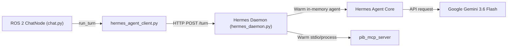

# Implementation Plan: PR-1535 Long-Lived Hermes Agent Daemon Service

**Jira Story:** PR-1535  
**Repository:** `pib-backend`  

## Architectural Design

## Implementation Steps

1. **Daemon Implementation (`public_api_client/hermes_daemon.py`):**
   - Implement `HermesDaemon` HTTP server (using Python `http.server` or `fastapi`/`starlette`).
   - Listen on `127.0.0.1:8088`.
   - Maintain warm agent instances / session handlers and FastMCP connections.

2. **Client Dispatch (`public_api_client/hermes_agent_client.py`):**
   - Update `run_turn()`: first attempt `POST http://127.0.0.1:8088/turn`.
   - If daemon answers with 200, return reply text immediately.
   - If daemon is unreachable (e.g. connection refused), fall back to `subprocess.run()`.

3. **Container Supervisor / Service Start (`ros_packages/voice_assistant/`):**
   - Start `hermes_daemon.py` in background at container launch (`ros_entrypoint.sh` or background thread in `assistant.py`).

4. **Testing:**
   - Unit tests covering daemon startup, `/turn` request handling, and fallback on daemon offline.
