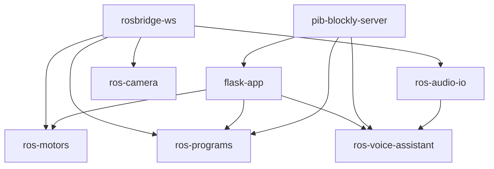

# Infrastructure and Deployment

**Repository:** `pib-backend`  
**Primary orchestration:** `docker-compose.yaml`  
**CI:** `.github/workflows/black.yml`  
**Host setup:** `setup/installation_scripts/docker_install.sh`, `setup/setup-pib.sh`

---

## Technology Stack

| Layer | Technology | Location |
|---|---|---|
| REST API | Flask 3 + SQLAlchemy + Marshmallow | `pib_api/flask/` |
| Blockly compiler | Node 18 + Blockly 10 | `pib_blockly/pib_blockly_server/` |
| Robotics | ROS2 Humble | `ros_packages/` |
| Hardware bridge | Tinkerforge (host `4223`) | `pib_motors`, `button_service` |
| Database | SQLite file | `pib_api/flask/pibdata.db` (Docker: `/app/pibdata.db`) |
| Frontend (external) | Cerebra (separate repo) | `setup/…/docker_install.sh` starts `$FRONTEND_DIR/docker-compose.yaml` |
| Reverse proxy (bare metal) | nginx | `setup/setup_files/nginx.conf` |
| CI lint | Black | `.github/workflows/black.yml` |
| MQTT | **Not present** in this repository | — |

---

## Docker Compose Architecture

**Project name:** `multirepo` (from `.env` → `COMPOSE_PROJECT_NAME`)  
**Network:** `pib-network` (bridge, internal DNS between services)

### Services Always Started (no profile)

| Service | Image | Ports | Restart | Depends on |
|---|---|---|---|---|
| `pib-blockly-server` | `pib-blockly-server` | `2442:2442` | `always` | — |
| `flask-app` | `flask_api` | `5000:5000` | `always` | `pib-blockly-server` |
| `rosbridge-ws` | built from `ros_packages/rosbridge` | `9090:9090` | `always` | — |

### Profile-Gated Services

| Service | Profile(s) | Ports | Privileged | Depends on |
|---|---|---|---|---|
| `ros-camera` | `all`, `camera` | — | yes | `rosbridge-ws` |
| `ros-motors` | `all`, `motors` | — | no | `rosbridge-ws`, `flask-app` |
| `ros-programs` | `all`, `programs` | — | no | `rosbridge-ws`, `pib-blockly-server`, `flask-app` |
| `ros-voice-assistant` | `all`, `voice_assistant` | — | yes | `rosbridge-ws`, `flask-app`, `pib-blockly-server`, `ros-audio-io` |
| `ros-display` | `all`, `display` | — | yes | — |
| `ros-audio-io` | `all`, `ros_audio_io`, `voice_assistant` | — | yes | `rosbridge-ws` |

**Production Pi command:** `docker compose --profile all up -d --build` (`setup/installation_scripts/docker_install.sh`).

---

## Container Build Contexts

| Service | Dockerfile | Build context |
|---|---|---|
| `flask-app` | `pib_api/flask/Dockerfile` | repo root `.` |
| `pib-blockly-server` | `pib_blockly/pib_blockly_server/Dockerfile` | `pib_blockly/pib_blockly_server` |
| `rosbridge-ws` | `ros_packages/rosbridge/Dockerfile` | `ros_packages` |
| `ros-motors` | `ros_packages/motors/Dockerfile` | repo root `.` |
| `ros-programs` | `ros_packages/programs/Dockerfile` | repo root `.` |
| `ros-voice-assistant` | `ros_packages/voice_assistant/Dockerfile` | repo root `.` |
| `ros-camera` | `ros_packages/camera/Dockerfile` | `ros_packages` |
| `ros-display` | `ros_packages/display/Dockerfile` | repo root `.` |
| `ros-audio-io` | `ros_packages/ros_audio_io/Dockerfile` | repo root `.` |

**Shared entrypoint:** `/ros_entrypoint.sh` — sources ROS Humble + colcon workspace, then `exec "$@"`.

---

## Volumes and Mounts

| Mount | Service(s) | Purpose |
|---|---|---|
| `programs` (named volume) | `flask-app`, `ros-programs` | Shared Blockly-compiled `.py` programs |
| `./pib_api/flask/:/app` | `flask-app` | Live code mount (dev) |
| `/dev/bus/usb` | `ros-camera`, `ros-motors`, `ros-programs`, audio | USB hardware |
| `/dev/:/dev/` | `ros-camera` | Full device access |
| `/dev/snd`, Pulse socket | audio, voice | ALSA/PulseAudio |
| `${XDG_RUNTIME_DIR}/pulse/native` | audio, voice | Pulse native socket |
| `/home/pib/.config/pulse/cookie` | audio, voice | Pulse auth |
| `/home/pib/wav-files` (ro) | audio, voice | WAV playback assets |
| `./ros_packages/display/expression_faces` (ro) | `ros-display` | Face images |
| `/dev/dri`, Wayland runtime | `ros-display` | GPU/Wayland display |

---

## Network Boundaries

```text
Host (Pi)
├── localhost:5000  → flask-app
├── localhost:2442  → pib-blockly-server
├── localhost:9090  → rosbridge-ws (WebSocket)
├── host.docker.internal:4223 → Tinkerforge stack (from containers)
└── pib-network (bridge)
    ├── flask-app
    ├── pib-blockly-server
    ├── rosbridge-ws
    ├── ros-motors / ros-programs / … (profile all)
    └── DNS names match service names
```

**No TLS termination** in backend compose. nginx on bare-metal install serves Cerebra static files (`setup/setup_files/nginx.conf`).

---

## Startup Sequence and Dependencies

### Docker Compose `depends_on` (ordering only — **no health checks**)



### Runtime boot order (observed behavior)

| Step | Component | Behavior |
|---|---|---|
| 1 | `pib-blockly-server` | Listens `:2442` |
| 2 | `flask-app` | `db upgrade` → `seed_db` → `flask run :5000` |
| 3 | `rosbridge-ws` | WebSocket `:9090` |
| 4 | `ros-motors` | Import `pib_motors` → **requires Flask `GET /motor` and `/bricklet`** |
| 5 | `ros-programs` | Starts `button_service_node` background + `program` + `proxy_program` |
| 6 | `rgb_button_control` | **Blocks** on `wait_for_service(proxy_run_program_*)` |
| 7 | `proxy_program` | **Blocks** on `wait_for_server(run_program)` |
| 8 | `motor_control` | Loads settings from Flask; waits for SSR before startup pose (if SSR present) |

**Critical:** `depends_on` does **not** wait for Flask HTTP readiness. `ros-motors` may crash once and restart (`restart: always`) if Flask is slow.

### flask-app container command

```bash
flask --app run db upgrade && flask --app run seed_db && flask --app run run --host 0.0.0.0
```

### ros-programs container command

```bash
source /opt/ros/jazzy/setup.bash &&
source /app/ros2_ws/install/setup.bash &&
ros2 run button_service button_service_node &
ros2 launch programs launch.py
```

---

## Environment Files

| File | Committed | Purpose |
|---|---|---|
| `.env` | yes | `COMPOSE_PROJECT_NAME=multirepo` |
| `ros-audio.env` | yes | Mic device config (`MIC_DEVICE`, `MIC_CHANNELS`, `MIC_RATE`, `MIC_PROCESSED_CHANNEL`) |
| `password.env` | **no** (generated at install) | `TRYB_URL_PREFIX=https://platform.tryb.ai` written by `docker_install.sh` |

### flask-app environment (compose)

| Variable | Value |
|---|---|
| `SQLALCHEMY_DATABASE_URI` | `sqlite:////app/pibdata.db` |
| `PIB_BLOCKLY_SERVER_URL` | `http://pib-blockly-server:2442` |

### ros-motors / ros-programs environment

| Variable | Value |
|---|---|
| `FLASK_API_BASE_URL` | `http://flask-app:5000` |
| `PIB_BLOCKLY_SERVER_URL` | `http://pib-blockly-server:2442` |
| `TINKERFORGE_HOST` | `host.docker.internal` |
| `TINKERFORGE_PORT` | `4223` |

### ros-programs additional

| Variable | Value |
|---|---|
| `PROGRAM_DIR` | `/ros2_ws/cerebra_programs` |
| `PYTHON_BINARY` | `/usr/bin/python3` |
| `TF_BUTTON_BRICKLET_NUMBERS` | `5,6,7` |
| `SSH_HOST` | `host.docker.internal` |

### ros-voice-assistant

| Variable | Source |
|---|---|
| `FLASK_API_BASE_URL` | `http://flask-app:5000` |
| `PULSE_SERVER` | Pulse socket mount |
| `env_file` | `ros-audio.env`, `password.env` |

### ros-display

| Variable | Default |
|---|---|
| `PIB_DISPLAY_WIDTH` / `HEIGHT` | `1024` / `600` |
| `PIB_DISPLAY_ON_DEMAND` | `1` |
| `WAYLAND_DISPLAY` | `wayland-0` |
| `GDK_BACKEND` | `wayland` |

---

## Shell Scripts Reference

| Script | Purpose |
|---|---|
| `setup/setup-pib.sh` | Full Pi provisioning orchestrator |
| `setup/update-pib.sh` | Pull + rebuild deployment |
| `setup/installation_scripts/docker_install.sh` | Docker engine + `compose --profile all up` + Cerebra compose |
| `setup/installation_scripts/local_install.sh` | Non-Docker bare-metal ROS install |
| `setup/dev_tools/health-check-pib.sh` | Ubuntu packages, colcon, systemd service checks |
| `setup/dev_tools/local_cerebra_remote_deploy.sh` | Build/deploy Cerebra to remote Pi |
| `ros_packages/ros_entrypoint.sh` | ROS workspace sourcing for all ROS containers |
| `ros_packages/button_service/start_button_service.sh` | Standalone button service starter |
| `ros_packages/*/boot_scripts/*.sh` | systemd boot wrappers (bare-metal install) |

---

## systemd Services (Bare Metal — from health-check)

| Service | Component |
|---|---|
| `pib_api_boot.service` | Flask API |
| `ros_motor_control_node_boot.service` | Motor control |
| `ros_program_boot.service` / `ros_proxy_program_boot.service` | Programs |
| `ros_cerebra_boot.service` | Cerebra frontend |
| `ros_voice_assistant_boot.service` | Voice assistant |
| `ros_camera_boot.service` | Camera |
| `docker_cleaner.service` | Periodic Docker cleanup (Docker install path) |

---

## CI/CD

### Workflow: `black.yml`

| Property | Value |
|---|---|
| Trigger | `push` (all branches) |
| Runner | `ubuntu-latest` |
| Steps | `actions/checkout@v3` → `psf/black@stable` |
| Scope | Python formatting lint only |
| Integration/E2E tests | **Not configured** in this repository |

---

## External Dependencies (Not in Compose)

| Dependency | Access | Required by |
|---|---|---|
| Tinkerforge stack | Host `:4223` via `host.docker.internal` | Motors, buttons, SSR |
| Cerebra frontend | Separate compose / nginx | User UI |
| Tryb public API | HTTPS (token via `password.env`) | Voice assistant LLM |
| OAK-D camera USB | `/dev/bus/usb` | `ros-camera` profile |
| PulseAudio / ALSA | `/dev/snd` + socket | Voice + audio-io |

---

## Testcontainers / Compose Test Profiles

| Test profile | Minimum services | Verification |
|---|---|---|
| API contract | `flask-app`, `pib-blockly-server` | HTTP `:5000`, `:2442` |
| ROS motor unit | `ros-motors`, `flask-app`, Tinkerforge mock | Srv `apply_joint_trajectory` |
| E2E program run | `flask-app`, `ros-programs`, `rosbridge-ws` | Action `run_program` via proxy |
| Full robot | `--profile all` | All ports + hardware |

---

## Known Infrastructure Gaps (Test Oracles)

| Gap | Impact |
|---|---|
| No `healthcheck` in compose | `depends_on` is start-order only |
| No Flask readiness probe for ROS | Race on cold boot |
| `flask-app` bind-mount in compose | Dev-oriented; production image bakes code |
| Hard-coded host paths (`/home/pib/…`) | Voice/display mounts fail off-Pi |
| No HTTP 503 gateway | ROS timeouts invisible to REST clients |
