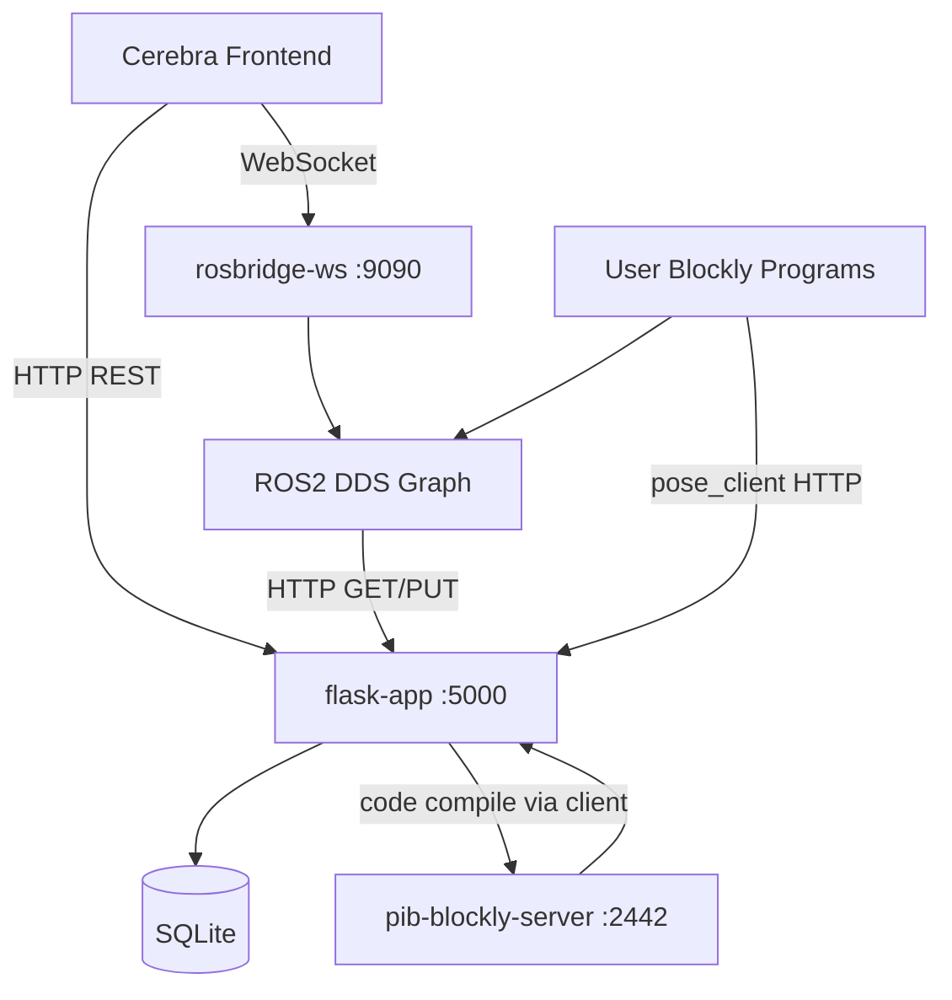

# ROS2 Interfaces

**Repository:** `pib-backend`  
**ROS distro:** Humble  
**Custom messages package:** `datatypes`  
**Network:** Docker bridge `pib-network`; rosbridge exposes WebSocket `:9090` to host

---

## Integration Topology

**Flask never publishes ROS messages.** ROS nodes consume Flask via `pib_api_client`.

---

## Web Endpoint → ROS Trigger Map

| Trigger | HTTP / UI path | ROS interface | Mechanism |
|---|---|---|---|
| Save/run program | `PUT /program/{id}/code` | Action `run_program` | Compiled `.py` executed by `program` node |
| Run from UI | Cerebra → rosbridge | Action `run_program` or Srv `proxy_run_program_start` | Direct ROS |
| Button press | — (hardware) | Srv `proxy_run_program_start` | `rgb_button_control` reads `GET /button-programs` |
| Button mapping change | `PUT /button-programs` | Topic `set_button_color` (indirect) | Poll every 5s updates LED assignment |
| Motor move (live) | Cerebra / Blockly | Srv `apply_joint_trajectory` | Direct ROS |
| Pose move (Blockly) | `GET /pose/{id}/motor-positions` | Srv `apply_joint_trajectory` | `pose_client` HTTP then ROS service loop |
| Motor settings | `PUT /motor/{name}/settings` | Srv `apply_motor_settings` | Persisted when ROS applies settings |
| Startup pose | — (boot) | Internal `apply_joint_trajectory` | `StartupPoseExecutor` reads `GET /pose/by-name/Startup%2FResting` |
| SSR toggle | Blockly / UI | Srv `set_solid_state_relay_state` | Direct ROS |
| TF button Blockly | — | Topic `set_button_color`, Srv `/tf_button/*` | `blockly_client` in user programs |
| Voice chat | Cerebra | Action `chat` | `chat` node persists via `voice_assistant_client` HTTP |
| Camera preview | Cerebra → rosbridge | Topic `camera_topic` | `camera_node` |
| Camera snapshot (LLM) | — | Srv `get_camera_image` | `chat` node client |

---

## ROS2 Nodes (Docker / Launch)

| Container | Launch command | Nodes started |
|---|---|---|
| `ros-motors` | `ros2 launch motors launch.py` | `motor_control`, `motor_current`, `relay_control`, `rgb_button_control` |
| `ros-programs` | `button_service_node` + `ros2 launch programs launch.py` | `button_service_node`, `program`, `proxy_program` |
| `ros-voice-assistant` | `ros2 launch voice_assistant launch.py` | `assistant`, `audio_player`, `audio_recorder`, `chat`, `token_service` |
| `ros-camera` | `ros2 run oak_d_lite stereo` | `camera_node` |
| `ros-display` | `ros2 launch display launch.py` | `expression_manager`, display backend |
| `ros-audio-io` | `ros2 launch ros_audio_io launch.py` | `audio_streamer`, `doa_publisher` |
| `rosbridge-ws` | `ros2 launch rosbridge_server rosbridge_websocket_launch.xml` | rosbridge WebSocket server |

---

## Topics

| Topic | Message type | Publisher(s) | Subscriber(s) |
|---|---|---|---|
| `joint_trajectory` | `trajectory_msgs/JointTrajectory` | `motor_control` | loggers, sim |
| `motor_settings` | `datatypes/MotorSettings` | `motor_control` | — |
| `solid_state_relay_state` | `datatypes/SolidStateRelayState` | `relay_control` | `motor_control`, Blockly SSR read |
| `set_button_color` | `datatypes/ButtonColor` | `blockly_client`, `rgb_button_control` | `rgb_button_control` |
| `proxy_run_program_feedback` | `datatypes/ProxyRunProgramFeedback` | `proxy_program` | Cerebra/rosbridge |
| `proxy_run_program_result` | `datatypes/ProxyRunProgramResult` | `proxy_program` | `rgb_button_control` |
| `proxy_run_program_status` | `datatypes/ProxyRunProgramStatus` | `proxy_program` | Cerebra/rosbridge |
| `program_input` | `datatypes/ProgramInput` | Cerebra/frontend | `program` |
| `camera_topic` | `std_msgs/String` | `camera_node` | Cerebra preview |
| `face_center_topic` | `geometry_msgs/Point` | `camera_node` | detectors |
| `timer_period_topic` | `std_msgs/Float64` | frontend bridge | `camera_node` |
| `quality_factor_topic` | `std_msgs/Int32` | frontend bridge | `camera_node` |
| `size_topic` | `std_msgs/Int32MultiArray` | frontend bridge | `camera_node` |
| `chat_messages` | `datatypes/ChatMessage` | `chat` | UI loggers |
| `public_api_token` | `std_msgs/String` | `token_service` | `chat`, audio nodes |
| `voice_assistant_state` | `datatypes/VoiceAssistantState` | `assistant` | — |
| `chat_is_listening` | `datatypes/ChatIsListening` | `assistant` | — |
| `/display_image` | `datatypes/DisplayImage` | `expression_manager` | `display` |
| `/pib/expression` | `std_msgs/String` | Blockly programs | `display` |
| `/pib/display_text` | `std_msgs/String` | Blockly programs | `display` |
| `/pib/display_hide` | `std_msgs/String` | — | `display` |
| `/pib/display_ready` | `std_msgs/String` | `display` | — |
| `audio_stream` | `std_msgs/Int16MultiArray` | `audio_streamer` | `audio_recorder` |
| `doa_angle` | `std_msgs/Int32` | `doa_publisher` | — |
| `motor_current` | (custom) | `motor_current` | — |

---

## Services

| Service name | Type | Provider | Request → Response |
|---|---|---|---|
| `apply_joint_trajectory` | `datatypes/ApplyJointTrajectory` | `motor_control` | `JointTrajectory` → `bool successful` |
| `apply_motor_settings` | `datatypes/ApplyMotorSettings` | `motor_control` | `MotorSettings` → `bool settings_applied`, `bool settings_persisted` |
| `get_joint_position` | `datatypes/GetJointPosition` | `motor_control` | `string joint_name` → `bool successful`, `int32 position`, `string message` |
| `set_solid_state_relay_state` | `datatypes/SetSolidStateRelay` | `relay_control` | `SolidStateRelayState` → `bool successful` |
| `proxy_run_program_start` | `datatypes/ProxyRunProgramStart` | `proxy_program` | `string program_number` → `string proxy_goal_id` |
| `proxy_run_program_stop` | `datatypes/ProxyRunProgramStop` | `proxy_program` | `string proxy_goal_id` → (empty) |
| `get_camera_image` | `datatypes/GetCameraImage` | `camera_node` | — → `string image_base64` |
| `vision_prompt` | `datatypes/VisionPrompt` | `chat` | vision LLM prompt |
| `create_or_update_chat_message` | `datatypes/CreateOrUpdateChatMessage` | `chat` | stream persistence bridge |
| `set_voice_assistant_state` | `datatypes/SetVoiceAssistantState` | `assistant` | — |
| `get_voice_assistant_state` | `datatypes/GetVoiceAssistantState` | `assistant` | — |
| `get_chat_is_listening` | `datatypes/GetChatIsListening` | `assistant` | — |
| `send_chat_message` | `datatypes/SendChatMessage` | `assistant` | — |
| `play_audio_from_speech` | `datatypes/PlayAudioFromSpeech` | `audio_player` | — |
| `play_audio_from_file` | `datatypes/PlayAudioFromFile` | `audio_player` | — |
| `clear_playback_queue` | `datatypes/ClearPlaybackQueue` | `audio_player` | — |
| `get_mic_configuration` | `datatypes/GetMicConfiguration` | `audio_recorder` / `audio_streamer` | — |
| `encrypt_token` / `decrypt_token` / `get_token_exists` | `datatypes/srv/*` | `token_service` | — |
| `/tf_button/set_color` | `button_service/SetButtonColor` | `button_service_node` | legacy direct set |
| `/tf_button/read` | `button_service/ReadButton` | `button_service_node` | read taster/switch |
| `/tf_button/wait` | `button_service/WaitForButton` | `button_service_node` | wait for press |
| `/rgb_button/manual_override` | `button_service/SetButtonManualOverride` | `rgb_button_control` | compat bridge → `set_button_color` topic |

---

## Actions

| Action | Type | Server | Clients |
|---|---|---|---|
| `run_program` | `datatypes/RunProgram` | `program` | `proxy_program`, `assistant` |
| `chat` | `datatypes/Chat` | `chat` | `assistant`, `audio_loop` |
| `record_audio` | `datatypes/RecordAudio` | `audio_recorder` | `assistant` |

### `RunProgram`

| Field | Type | Values |
|---|---|---|
| Goal `source_type` | `byte` | `0=SOURCE_PROGRAM_NUMBER`, `1=SOURCE_CODE_VISUAL` |
| Goal `source` | `string` | program UUID or visual JSON |
| Result `exit_code` | `int8` | process return code; `2` on abort/compile failure |
| Feedback `mpid` | `uint32` | running process ID |
| Feedback `output_lines` | `ProgramOutputLine[]` | stdout/stderr lines |

### `Chat`

| Field | Type |
|---|---|
| Goal | `text`, `chat_id`, `generate_code` |
| Result | `text`, `text_type` |
| Feedback | `text`, `text_type` (`0=sentence`, `1=code_visual`) |

---

## Message Type Reference

### `datatypes/ButtonColor`

| Field | Type |
|---|---|
| bricklet_uid | string |
| red, green, blue | uint8 |
| sticky | bool |
| clear | bool |

### `datatypes/MotorSettings`

| Field | Type |
|---|---|
| motor_name | string |
| turned_on, visible, invert | bool |
| pulse_width_min/max | int64 |
| rotation_range_min/max | int16 |
| velocity, acceleration, deceleration, period | int64 |

### `datatypes/ProxyRunProgramResult`

| Field | Type |
|---|---|
| proxy_goal_id | string |
| exit_code | uint8 |

### `trajectory_msgs/JointTrajectory` (Blockly convention)

| Field | Usage |
|---|---|
| `joint_names[0]` | Single motor name |
| `points[0].positions[0]` | Target (1/100°) |

---

## std_msgs / geometry_msgs Mapping

| Message | Topic | Direction |
|---|---|---|
| `std_msgs/Float64` | `timer_period_topic` | → `camera_node` |
| `std_msgs/Int32` | `quality_factor_topic` | → `camera_node` |
| `std_msgs/Int32MultiArray` | `size_topic` | → `camera_node` |
| `std_msgs/String` | `camera_topic`, `/pib/expression`, `/pib/display_text`, `/pib/display_hide`, `/pib/display_ready`, `public_api_token` | pub/sub |
| `std_msgs/Int16MultiArray` | `audio_stream` | pub |
| `std_msgs/Int32` | `doa_angle` | pub |
| `geometry_msgs/Point` | `face_center_topic` | pub |

---

## Environment Variables (ROS side)

| Variable | Default | Used by |
|---|---|---|
| `FLASK_API_BASE_URL` | `http://localhost:5000` | All `pib_api_client` modules |
| `PIB_BLOCKLY_SERVER_URL` | `http://localhost:2442` | `pib_blockly_client` |
| `PROGRAM_DIR` | `/home/pib/cerebra_programs` (host) / `/ros2_ws/cerebra_programs` (Docker) | `program` node |
| `PYTHON_BINARY` | venv python (host) / `/usr/bin/python3` (Docker) | `program` node |
| `TINKERFORGE_HOST` | `localhost` / `host.docker.internal` | `pib_motors.bricklet` |
| `TINKERFORGE_PORT` | `4223` | Tinkerforge stack |
| `TF_HOST` / `TF_PORT` | `host.docker.internal` / `4223` | `button_service_node` |
| `TF_BUTTON_BRICKLET_NUMBERS` | `5,6,7` | Button UID lookup |
| `VOICE_ASSISTANT_DIR` | package path | voice assistant assets |

---

## Module-Import Side Effects (Test Oracles)

| Module | Import-time behavior | Failure mode |
|---|---|---|
| `pib_motors.motor` | `GET /motor` | `RuntimeError` if Flask unreachable |
| `pib_motors.bricklet` | `GET /bricklet` + Tinkerforge connect | `RuntimeError` if Flask unreachable |
| `rgb_button_control` | `wait_for_service()` (no timeout) on proxy services | Blocks until `proxy_program` up |
| `proxy_program` | `wait_for_server()` on `run_program` | Blocks until `program` up |
